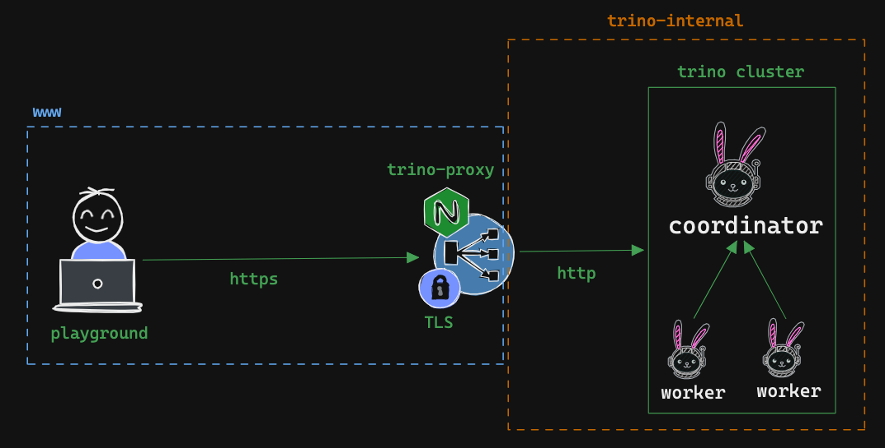

## Trino Security

This github repository describes how to implement authentication and authorization for Trino cluster.

### Trino Security architecture (docker)



### running Trino Cluster locally

#### running Trino Cluster with docker compose

```bash
docker-compose up -d
```

#### executing query with Trino CLI

```bash
docker compose exec playground trino --server https://trino-proxy --user trino --password --insecure
```

### recommended reading

- [Trino Security](https://trino.io/docs/current/security/overview.html)
- [Trino TLS Configuration](https://trino.io/docs/current/security/tls.html)
- [Trino Password Authentication](https://trino.io/docs/current/security/password-file.html)

---

Made with ❤️ by [nil1729](https://github.com/nil1729)
